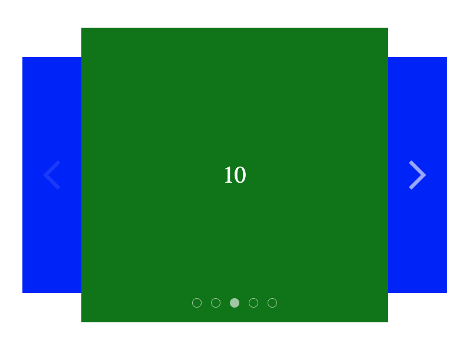

<h1 align="center">Slider (React, Typescript)</h1>

---

<h2 align="center">Available Scripts</h2>

npm run dev

npm run build

npm run lint

npm run preview

---

<h2 align="center">
UI-Kit Slider
</h2>

Slider is controlled using the keyboard and mouse.

Changing slides is possible:
using arrow buttons, dot buttons, swiping.
And optionally:
automatically, dragging the mouse.

---

